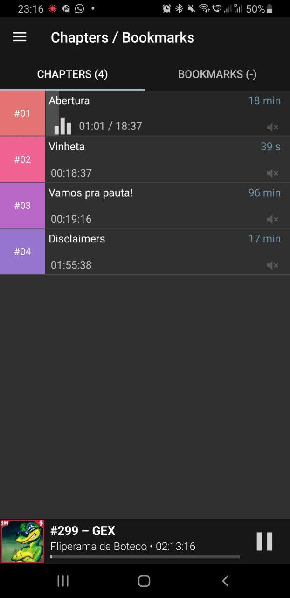

# Capítulos do Fliperama de Boteco

Este repositório contém os capítulos dos episódios do podcast [Fliperama de Boteco](https://fliperamadeboteco.com/).

Nossos capítulos são de código fonte aberto (Open Source).

Se você é ouvinte, nós queremos a sua participação para produzir esses capítulos!

## Como contribuir?

Veja mais em [CONTRIBUTING.md](./CONTRIBUTING.md).

## Precisa de Ajuda?

Se você tiver dúvidas, entre em contato conosco por qualquer um dos meios abaixo:

- Grupo do Telegram: <https://t.me/fliperamadeboteco>
- Twitter: <https://twitter.com/fdboteco>
- e-mail: <contato@fliperamadeboteco.com>

## Como ficam os capítulos nos apps?

Segue aqui um exemplo de como são mostrados os capítulos no app _Podcast Addict_.

## Referências

- [Especificação de `podcast:chapters` no _podcast_ namespace RSS](https://github.com/Podcastindex-org/podcast-namespace/blob/main/chapters/jsonChapters.md)
- [Apps que suportam funcionalidates Podcasting 2.0](https://podcastindex.org/apps) 